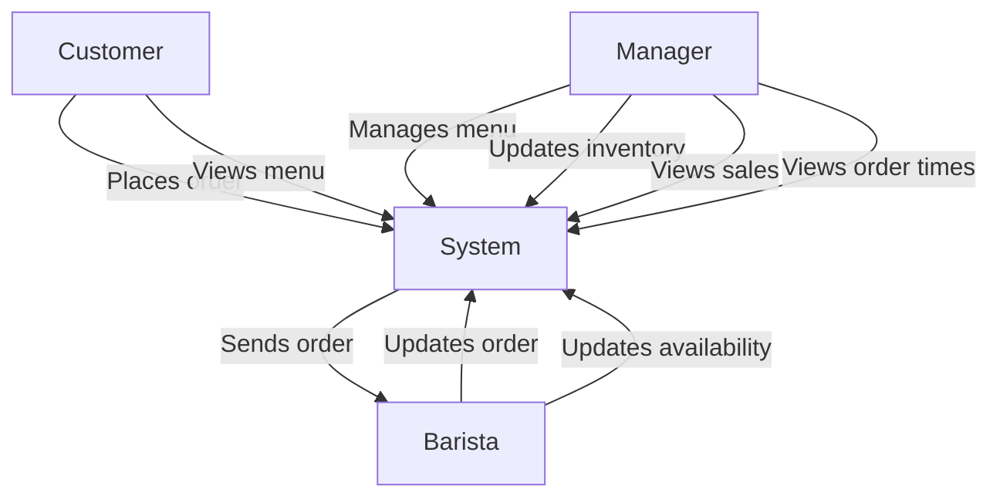

# Individual Sketch — Week [3] Round [1]
**Student:** [Anthony Vang]
**Date:** [9/10/2026]

--

## My Answer

*Respond directly to the prompt. Write in plain sentences — no need to be formal. You have 12 minutes total, so think first, then write.*

Most of the requirements are functional because they explain what the system should do. Some are non-functional because they explain how fast or reliable the system should be. Some requirements are unclear because they use words like “fast,” “right away,” and “low.”


---

## Diagram

*Include your Mermaid diagram below. If the prompt doesn't ask for a diagram, delete this section.*


## Diagram



```

---

## What I'm Not Sure About

*One or two sentences. What feels uncertain or wrong about what you just produced?*
I am not sure what “fast,” “right away,” and “low inventory” mean exactly. The owner should give specific numbers or rules for these.

---

**Commit this file before group discussion begins.**
