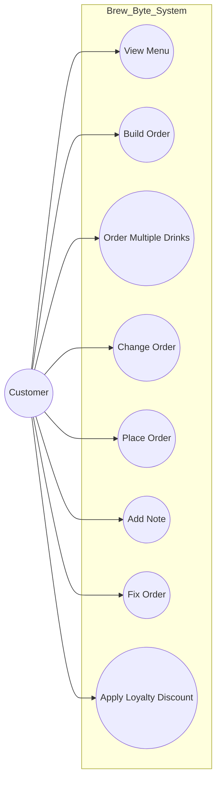

# Individual Sketch — Week [3] Round [2]
**Student:** [Anthony Vang]
**Date:** [Date]

---

## My Answer
1.Go through the functional requirements and write every use case they ask for, 
View the menu and prices — 2.1
Build an order — 2.2
Order multiple of the same drink — 2.3
Change or remove an item before ordering — 2.4
Place an order and receive a confirmation number — 2.5
Add a note to an order — 2.6
Fix an order after placing it — 2.7
Receive the loyalty discount — 2.8


2. Now put the document down and think about the shop. 
I think the customer should be able to cancel an order. This is not clearly stated in the requirements, but it seems like something a customer would need if they placed an order by mistake. I got this from thinking about how a real coffee shop would work.


3.Sketch your actor's part of the use case diagram


4.Actors. Three were named for you. Is that all of them? An actor is anything outside the system that interacts with it, and not every actor is a person. Name a fourth or say why there are only three.

I would say there are only three actors: Customer, Barista, and Manager.
The inventory supplier does not need to be an actor because the requirements say the manager updates the inventory when a delivery arrives. The supplier does not directly interact with the system.


*Respond directly to the prompt. Write in plain sentences — no need to be formal. You have 12 minutes total, so think first, then write.*

[Your response here]

---

## Diagram

*Include your Mermaid diagram below. If the prompt doesn't ask for a diagram, delete this section.*




```

---


**Commit this file before group discussion begins.**
