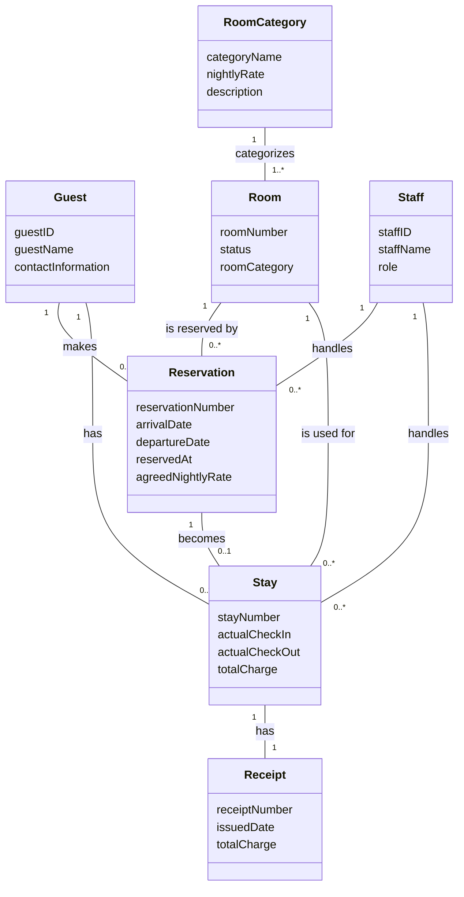
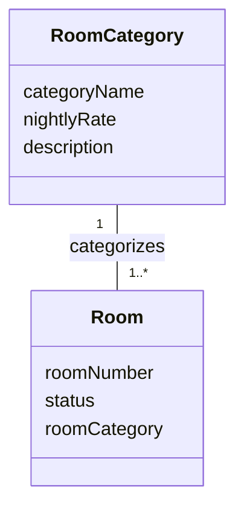
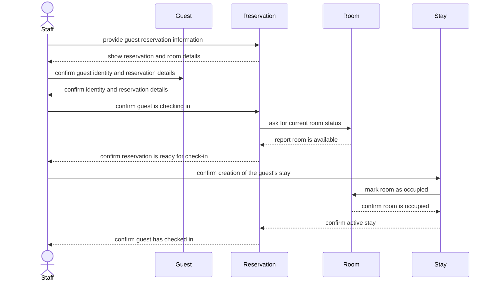

# analysis — 
**Student:** Anthony Vang
**Date:** 9/24/2026

---

# ICS 372 — Assignment 1: Domain Analysis and Modeling

Name: Anthony Vang
Date: September 24, 2026

## 1. Entity Inventory

### Guest

**What it is:**
A person who stays at or makes a reservation with Harborview Inn.

**What it knows:**

* guestID
* guestName
* contactInformation

**Rationale:**
A guest has an identity of their own and can have multiple reservations and stays associated with them.

### Room

**What it is:**
A specific physical room at Harborview Inn that a guest can reserve and stay in.

**What it knows:**

* roomNumber
* status
* roomCategory

**Rationale:**
Each room has its own identity, such as Room 314, and its status can be different from other rooms.

### RoomCategory

**What it is:**
A category of room offered by Harborview Inn, such as standard, deluxe, or suite.

**What it knows:**

* categoryName
* nightlyRate
* description

**Rationale:**
A room category has its own identity as a hotel offering and can describe multiple physical rooms.

### Reservation

**What it is:**
A booking that holds a specific room for a guest during specific dates.

**What it knows:**

* reservationNumber
* arrivalDate
* departureDate
* reservedAt
* agreedNightlyRate

**Rationale:**
A reservation has its own identity and represents a specific booking that can be referred to separately from the guest and room.

### Stay

**What it is:**
The actual visit of a guest at Harborview Inn after checking in.

**What it knows:**

* stayNumber
* actualCheckIn
* actualCheckOut
* totalCharge

**Rationale:**
A stay has its own identity because the actual visit can differ from the original reservation dates or plans.

### Receipt

**What it is:**
A record given to a guest at checkout showing the total charge for the stay.

**What it knows:**

* receiptNumber
* issuedDate
* totalCharge

**Rationale:**
A receipt has its own identity because it is a specific financial record associated with a completed stay.

### Staff

**What it is:**
A Harborview Inn employee who handles hotel reservations and guest stays.

**What it knows:**

* staffID
* staffName
* role

**Rationale:**
Each staff member has an identity of their own and can be distinguished from other employees.

---

## 2. Domain Model Diagram

The diagram separates the hotel room category from the individual physical room. It also separates a reservation from the actual stay because a reservation can exist before the guest arrives, while a stay represents what actually happened.

---

## 3. Detailed Use Case — Guest Check-In

### Use Case

Guest arrives to check in for a reservation made three weeks ago.

### Precondition

The guest has an existing reservation at Harborview Inn, the reservation is scheduled to arrive today, and the reservation has a room assigned to it.

### Main Flow

1. **Staff:** The staff member provides the guest's reservation information to the hotel system.

2. **System:** The system shows the reservation for the guest, including the arrival date, departure date, and reserved room.

3. **Staff:** The staff member confirms the guest's identity and reservation details.

4. **System:** The system confirms that the reservation is scheduled for today and shows the room's current status.

5. **Staff:** The staff member confirms that the guest is checking in.

6. **System:** The system creates an active stay connected to the reservation and the reserved room.

7. **System:** The system changes the room's status to occupied.

8. **System:** The system confirms that the guest has been checked in and shows the stay information.

### Alternative Flow 1 — Reservation Cannot Be Found

**Branches from Step 2.**

2A. **System:** The system cannot find a reservation matching the information provided.

2B. **Staff:** The staff member asks the guest for additional reservation information.

2C. **System:** The system finds the reservation using the additional information and shows the reservation details.

2D. The use case continues at Step 3.

### Alternative Flow 2 — Room Is Not Available

**Branches from Step 4.**

4A. **System:** The system shows that the room assigned to the reservation is under maintenance and cannot be occupied.

4B. **Staff:** The staff member identifies another available room that can be assigned to the guest.

4C. **System:** The system associates the available room with the reservation and shows the new room information.

4D. The use case continues at Step 5.

### Postcondition

The guest has an active stay, the reservation is connected to that stay, and the occupied room is recorded as occupied.

---

## 4. Specification and Instance

The two concepts I am separating are `RoomCategory` and `Room`. A `RoomCategory` is the general kind of room that Harborview Inn offers, such as a deluxe room, and it knows information such as the category name and standard nightly rate. A `Room` is one particular physical room, such as Room 314, and it knows its room number and current status. One room belongs to one room category, while one room category can describe many physical rooms.

For example, suppose Room 314 is a deluxe room on February 20, 2026, and the deluxe nightly rate is $180. On March 1, Harborview Inn changes the standard deluxe rate from $180 to $200. Room 314 does not become a different room just because the general deluxe rate changed. A reservation made on February 20 for March 10 through March 12 can still have an `agreedNightlyRate` of $180, while a new reservation made after March 1 could use the new $200 rate. The model keeps the room category, physical room, and reservation rate separate so that each one represents the correct thing.

If `RoomCategory` and `Room` were collapsed into one concept, the model would have trouble representing the difference between the general deluxe offering and a specific physical room. For example, it could no longer clearly answer which rooms are deluxe rooms while also keeping the identity and current status of Room 314 separate from the category's changing rate. It could also lead to an older reservation being charged the current category rate instead of the rate agreed to when the reservation was made. Keeping these concepts separate allows the hotel to change a category's information without changing the identity of every room in that category.

---

## 5. Sequence Diagram

One decision this sequence diagram forced me to make was that `Room` should be responsible for knowing its current status, because availability depends on the specific physical room. `Reservation` knows which room is connected to the booking, while `Room` knows whether that room is available, reserved, occupied, or under maintenance. The sequence also made me separate `Stay` from `Reservation`, because the reservation exists before check-in while the stay represents the actual visit. This is why the model has a separate relationship between `Reservation` and `Stay`.
