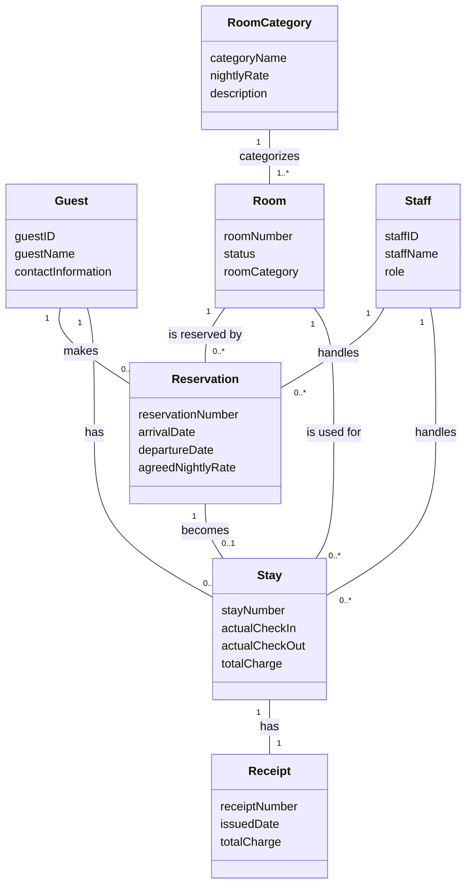
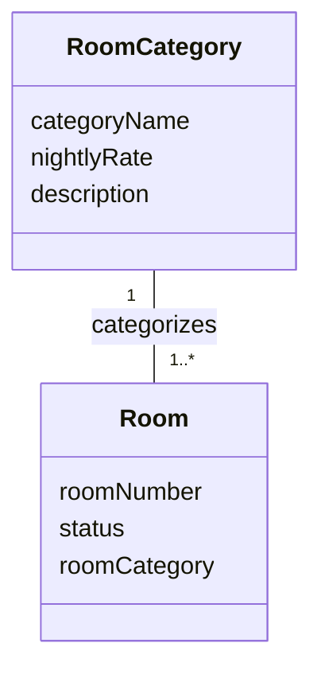
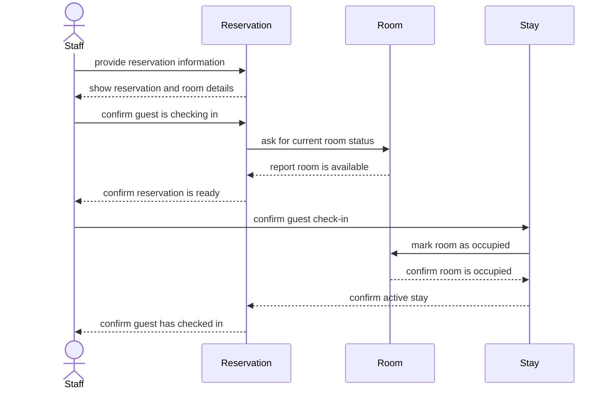

# analysis — 
**Student:** Anthony Vang
**Date:** 9/24/2026

---
# analysis — ICS 372 Assignment 1

**Student:** Anthony Vang
**Date:** 9/24/2026

---

# 1. Entity Inventory

## My Answer

### Guest

**What it is:** A person who makes a reservation or stays at Harborview Inn.

**What it knows:** guestID, guestName, contactInformation

**Rationale:** A guest has their own identity and can have multiple reservations and stays.

### Room

**What it is:** A specific physical room at Harborview Inn.

**What it knows:** roomNumber, status, roomCategory

**Rationale:** Each room has its own identity, such as Room 314, and can have its own status.

### RoomCategory

**What it is:** A type of room offered by the hotel, such as standard, deluxe, or suite.

**What it knows:** categoryName, nightlyRate, description

**Rationale:** A room category has its own identity and can describe many individual rooms.

### Reservation

**What it is:** A booking that holds a room for a guest for specific dates.

**What it knows:** reservationNumber, arrivalDate, departureDate, agreedNightlyRate

**Rationale:** A reservation has its own identity and represents one specific booking.

### Stay

**What it is:** The actual visit of a guest at the hotel after checking in.

**What it knows:** stayNumber, actualCheckIn, actualCheckOut, totalCharge

**Rationale:** A stay has its own identity because the actual visit is separate from the reservation made beforehand.

### Receipt

**What it is:** A record given to a guest at checkout showing the total charge.

**What it knows:** receiptNumber, issuedDate, totalCharge

**Rationale:** A receipt has its own identity as a specific financial record for a completed stay.

### Staff

**What it is:** An employee of Harborview Inn who handles hotel reservations and guest stays.

**What it knows:** staffID, staffName, role

**Rationale:** Each staff member has their own identity and can be different from other staff members.

---

# 2. Domain Model Diagram

## My Answer

My domain model contains seven entities: Guest, Room, RoomCategory, Reservation, Stay, Receipt, and Staff.

---

# 3. Detailed Use Case

## My Answer

### Use Case: Guest arrives to check in for a reservation made three weeks ago

**Precondition:** The guest has an existing reservation, the reservation is scheduled for today, and a room has been assigned.

### Main Flow

1. **Staff:** Provides the guest's reservation information.
2. **System:** Shows the matching reservation, arrival date, departure date, and room.
3. **Staff:** Confirms the guest's identity and reservation details.
4. **System:** Confirms that the reservation is scheduled for today and shows the room's current status.
5. **Staff:** Confirms that the guest is checking in.
6. **System:** Creates an active stay connected to the reservation and room.
7. **System:** Changes the room's status to occupied.
8. **System:** Confirms that the guest has been checked in.

### Alternative Flow 1 — Reservation Cannot Be Found

**Branches from Step 2.**

2A. **System:** Cannot find a reservation matching the information provided.

2B. **Staff:** Asks the guest for additional reservation information.

2C. **System:** Finds the reservation and shows its details.

2D. Continue at Step 3.

### Alternative Flow 2 — Room Is Under Maintenance

**Branches from Step 4.**

4A. **System:** Shows that the assigned room is under maintenance and cannot be occupied.

4B. **Staff:** Selects another available room for the guest.

4C. **System:** Associates the available room with the reservation and shows the new room information.

4D. Continue at Step 5.

**Postcondition:** The guest has an active stay, the reservation is connected to the stay, and the room is recorded as occupied.

---

# 4. Specification and Instance

## My Answer

The two concepts I am separating are RoomCategory and Room. A RoomCategory is the general type of room that Harborview Inn offers, such as a deluxe room. A Room is one particular physical room, such as Room 314. The RoomCategory knows the general category name and nightly rate, while the Room knows its room number and current status. One RoomCategory can describe many Rooms.

For example, Room 314 is a deluxe room. On February 20, the deluxe room rate is $180 per night. On March 1, the hotel changes the deluxe rate to $200. Room 314 is still the same physical room even though the general deluxe rate changed. A reservation made before March 1 could still have an agreed rate of $180, while a new reservation could use the new $200 rate.

If RoomCategory and Room were combined into one concept, the model could not clearly separate the general deluxe room information from the individual physical room. It could also cause an older reservation to use the current room category rate instead of the rate agreed to when the reservation was made. Keeping them separate allows the hotel to change information about a room category without changing the identity of every physical room.

### Relevant Diagram

---

# 5. Sequence Diagram

## My Answer

This sequence diagram shows the main flow of the guest check-in use case using objects from my model. Room knows the current status of the physical room, Reservation represents the booking, and Stay represents the actual visit.

---
