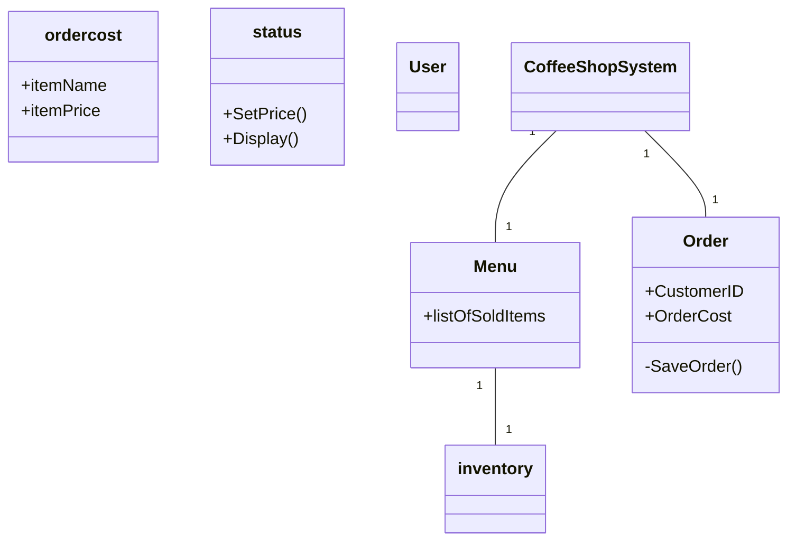

# Group Artifact — Week [2] Round [2]

**Group:** 4

**Members present:** Abraham, Snow, Na, Anthony, Riss

**Date:** 9/3/2026

  

---

  

## Our Design

  

I think for the order design we need customer ID, order cost, and status of the order.

  

---

  

## Diagram

  

---

  

## How We Got Here

  
Reading through the text, we started off by isolating nouns. After some discussion, we decided to add a bit more, namely user.

  

---

  

## Where We Disagreed

  

One disagreement we had is if nouns such as customers, emplyoee, and so on were to be added as entities. We decided to just go with "user", as there are potentially unique roles that are needed. That said, there's a chance that these are external to the system. 

  

---

  

## What We're Not Sure About

  

If we should add "users", and then more detailed users in the system.
