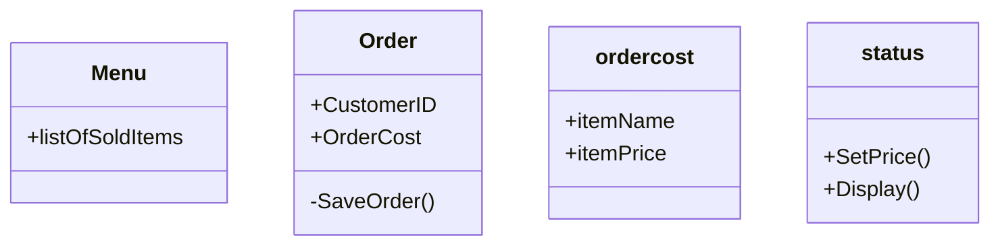

# Group Artifact — Week [2] Round [2]

**Group:** 4

**Members present:** Abraham, Snow, Na, Anthony, Riss

**Date:** 9/3/2026

  

---

  

## Our Design

  

I think for the order design we need customer ID, order cost, and status of the order.

  

---

  

## Diagram

  

---

  

## How We Got Here

  
making sure employees managers and customers make changes to the order. Mainly being able to record status of the order.

  

---

  

## Where We Disagreed

  

making the order traceable and trackable. making sure it has a time stamp.

  

---

  

## What We're Not Sure About

  
if the order needs 
