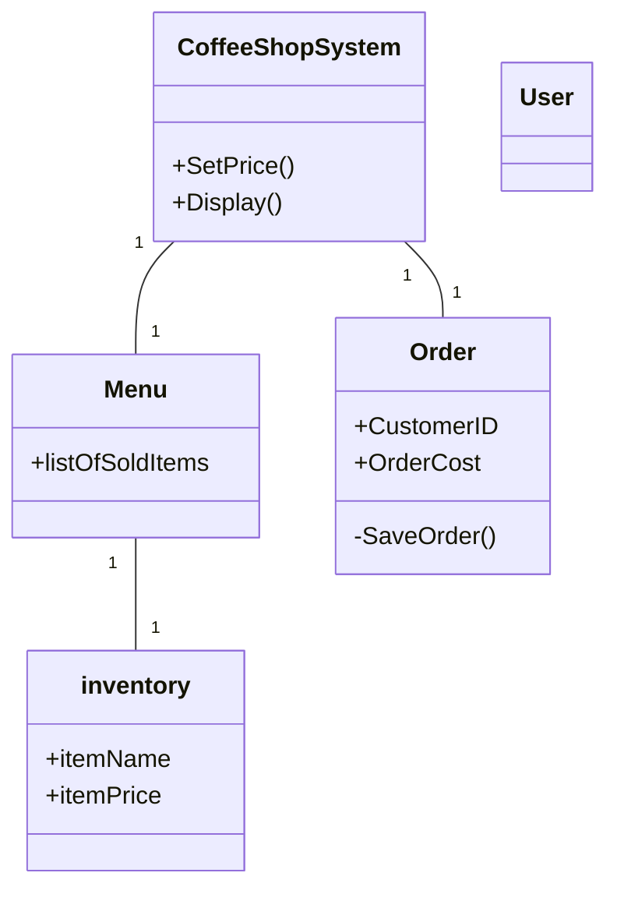

# Group Artifact — Week [2] Round [2]

**Group:** 4

**Members present:** Abraham, Snow, Na, Anthony, Riss

**Date:** 9/3/2026

  

---

  

## Our Design

  

Our design is fairly basic, but aims to lay out large parts of the system. "CoffeeShopSystem" aims to be the work horse that deals with changes within the system, Menu works as a collection of items that are being posted for sale, inventory aims to be the specific items that are being sold and how they update, order is the sale and calculation of all items from a customer. User aims to be a way that a role can be selected for what is being done.  

  

---

  

## Diagram

  

---

  

## How We Got Here

  
Reading through the text, we started off by isolating nouns. After some discussion, we decided to add a bit more, namely user.

  

---

  

## Where We Disagreed

  

One disagreement we had is if nouns such as customers, emplyoee, and so on were to be added as entities. We decided to just go with "user", as there are potentially unique roles that are needed. That said, there's a chance that these are external to the system. 

  

---

  

## What We're Not Sure About

  

If we should add "users", and then more detailed users in the system.
