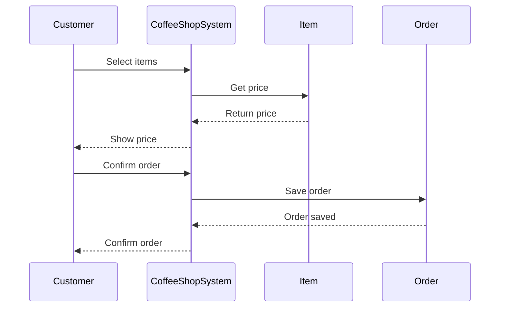
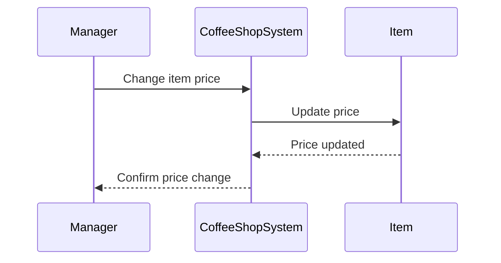
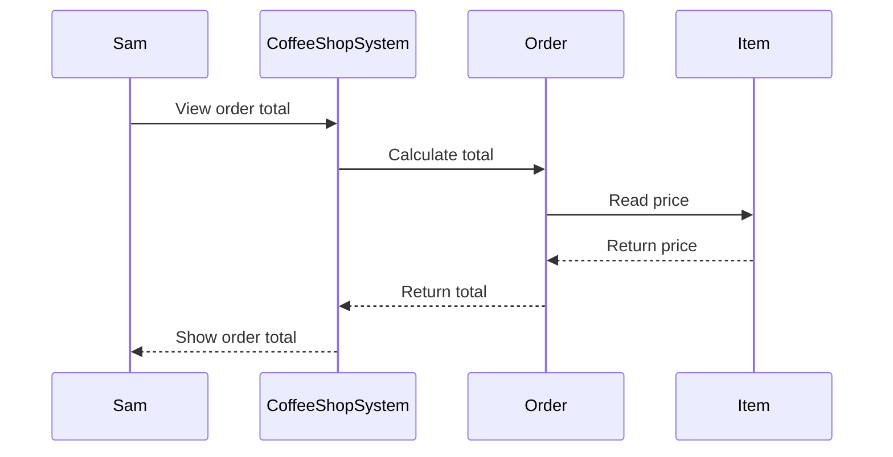

# Individual Sketch — Week 4 Round 2
**Student:** Anthony Vang
**Date:** 9/17/2026

*Delete every italic instruction and every bracketed placeholder before you commit. What is left should read as your writing, not as a form with answers inserted.*

---

## 1. Tonight's Prompt
02 - Individual Sketch
Working alone, against your group's docs/design/domain-model.md:

1.Draw Customer Places Order as a sequence diagram in Mermaid, working from the numbered steps of the use case you wrote last week. The actor, at least three entities named exactly as your model names them, every arrow labelled with the message in plain language — askForCurrentPrice, not getPrice() — and the return path, not just the outgoing calls.

2.Then draw the price change. Two short diagrams or one, your choice: the manager changing the price, and Sam's order being totalled. Follow the arrow that reads the price and say exactly which object it lands on.
Yes — copy these directly into GitHub. They are Mermaid code:

3.State what your model says Sam paid, honestly. If it charges him five dollars, write that down. If you cannot tell, write that down — being unable to tell is itself the answer.
Order class
CustomerID
OrderID
Items[]
TotalCost
isComplete

Our model says that Sam paid the order's TotalCost, but it does not specify the exact dollar amount. We would need more information to determine the exact amount.

## 2. What I'm Not Sure About
I am not completely sure if the price change and order total should go directly through the Item object or through the CoffeeShopSystem. I also want to make sure the price arrow correctly shows that the Order reads the price from the Item.

**Commit this file before group discussion begins.**
