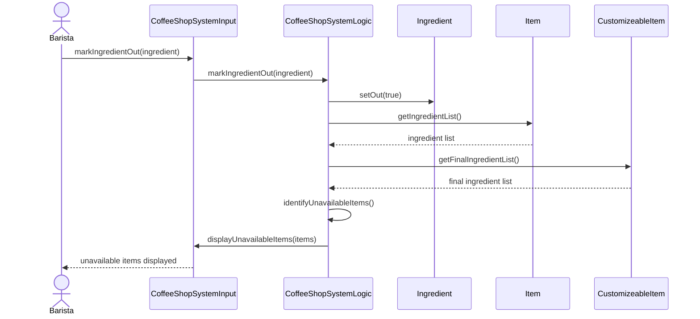

# Individual Sketch — Week [7] Round [1]
**Student:** [Anthony Vang]
**Date:** [10/8/2026]

*Delete every italic instruction and every bracketed placeholder before you commit. What is left should read as your writing, not as a form with answers inserted.*

---

## 1. Tonight's Prompt

**25 minutes, alone.** Commit to `week-07/individual-sketch.md`.

## Checklist

Check every box before you commit. **10 points.**

- [ ] One Mermaid sequence diagram for the **main flow** of your use case, under step 1 **(4 pts)**
- [ ] Every solid arrow is a method that's already in your class diagram, **or** has a `MISSING` note directly under it **(3 pts)**
- [ ] The diagram renders on GitHub **(1 pt)**
- [ ] Section 2 of the template says what you're least sure of **(2 pts)**
- [ ] Committed to `week-07/individual-sketch.md` **(required: nothing is graded without it)**

---

You'll draw one of tonight's use cases as a sequence diagram, using your group's class diagram exactly as it stands in `docs/design/class-model.md`. Don't fix the class diagram tonight. When it can't do what the use case needs, write a note and propose a fix. Your group uses those notes in the group build.

**Which use case is yours.** Sort your group by first name, A to Z. The first person takes UC-1, the second UC-2, the third UC-3, the fourth UC-4. In a group of three, nobody takes UC-4 now; your group does it together at the start of the group build.

**About the example.** It uses the library system from the textbook, not Brew & Byte. It shows you the *shape* of what to write and nothing else.

Copy step 1 into **section 1 of your sketch file** and put your diagram directly under it.

**Step 1: The sequence diagram.** One Mermaid `sequenceDiagram` for the **main flow** of your use case. Leave the alternative flows out. Every arrow follows these rules:

1. The actor is an `actor`. Every class is a `participant`, named exactly as it is in your class diagram.
2. The actor's first arrow goes to the class in your model that should receive the request.
3. Every solid arrow (`->>`) is a method call, labeled `methodName(arguments)`. **The method must already exist on the class the arrow points to**, in your class diagram.
4. **A class can only call a class it's connected to by a line in your class diagram.**
5. Every method that returns something gets a dashed return arrow (`-->>`) labeled with what comes back.
6. When rule 3 or rule 4 fails, draw the arrow you need anyway and put a `MISSING` note directly under it: the method you propose, with its full signature, and why that class.

# Week 7: Individual Sketch

## 1. Step 1: The sequence diagram

I'm least sure about where ingredient availability should be stored. The current `Ingredient` class only has `name` and `ingredientId`, so it does not currently represent whether an ingredient is available. I proposed adding `setOut(isOut: boolean): void`, but the group should decide whether availability belongs in `Ingredient` or whether `CoffeeShopSystemLogic` should manage it as part of inventory.

I'm also unsure how the system should handle customizable menu items. If an ingredient is unavailable, the system may need to disable only the customization that uses it instead of making the entire menu item unavailable. For example, if a customer can order a latte without a particular syrup, the latte should remain available while that syrup is unavailable.

   
**Actor:** Barista

**Precondition:** A barista is using the system.

**Postcondition:** The ingredient is marked out, and nothing that needs it is offered to customers.

| Actor Action | System Response |
|---|---|
| **1.** Barista picks an ingredient and marks it out. | |
| | **2.** System records that the ingredient is out. |
| | **3.** System stops offering every menu item that needs the ingredient, and every customization that uses it. |
| | **4.** System shows the barista what is no longer offered. |

    
---

## 2. What I'm Not Sure About

*One or two sentences. What feels uncertain or wrong about what you just produced?*

*This is about your own thinking, and it is required every week. It is not the same thing as a question written for a stakeholder. When the prompt asks you for one of those, it belongs up in section 1 with the step that asked for it, and it does not replace this section.*

[Your response here]

---

**Commit this file before group discussion begins.**
